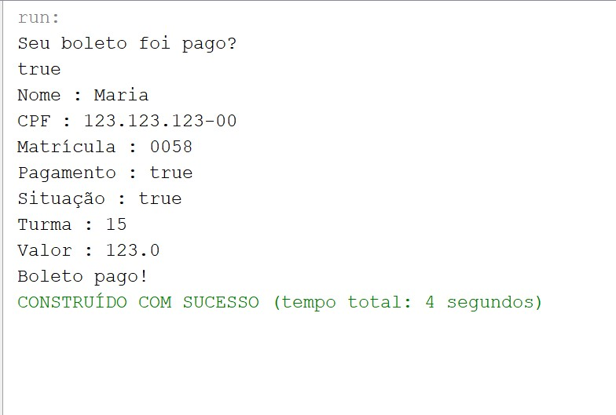
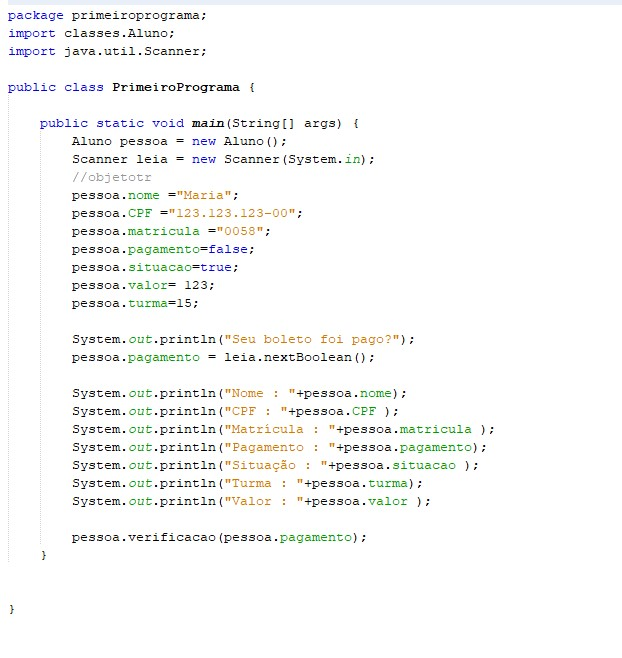

<h1>Primeiras linhas em Java 📛</h1>

<h2> Primeiro código JAVA </h2>

<h2>Explicação:</h2>

Coleque true ou false.

<h2>💻Tecnologias</h2>

- JAVA 

- GIT e GitHub 

<h2>📱Contato</h2>

viktorariel777@gmail.com

